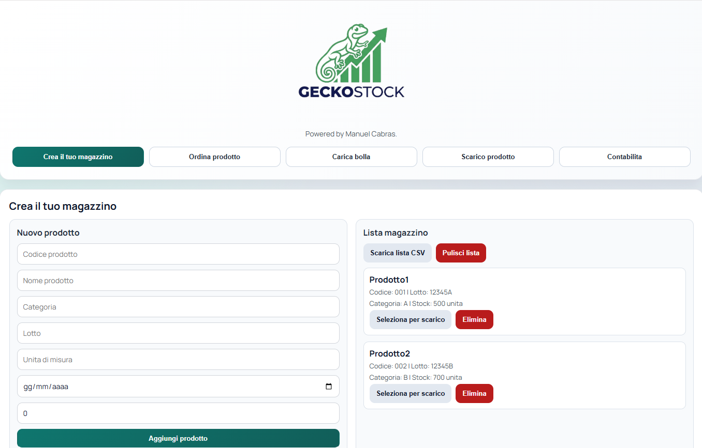
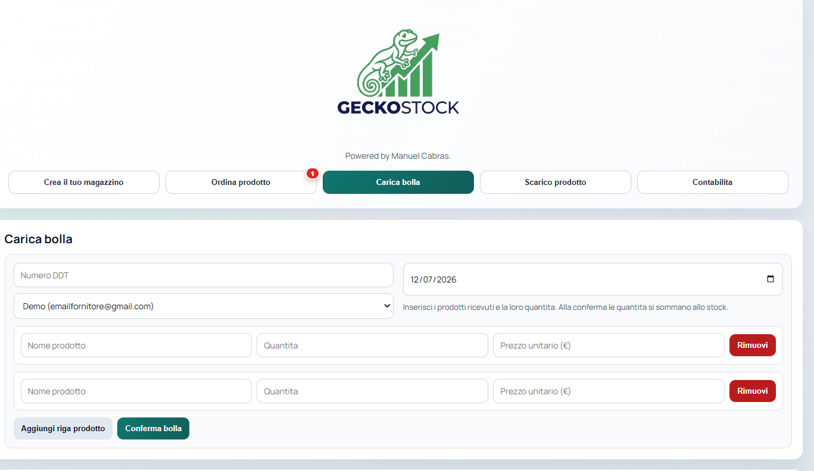
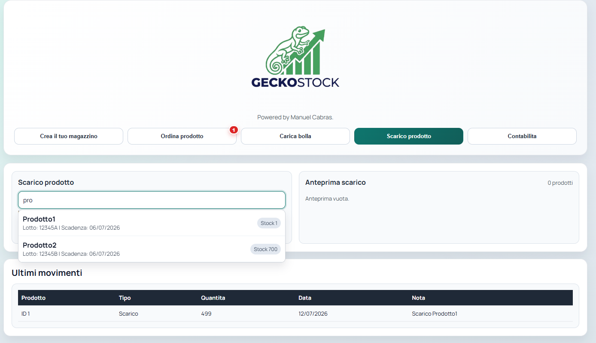
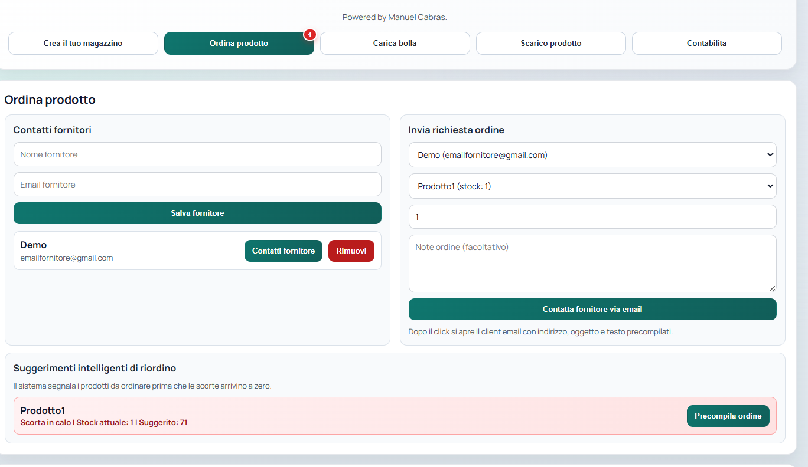
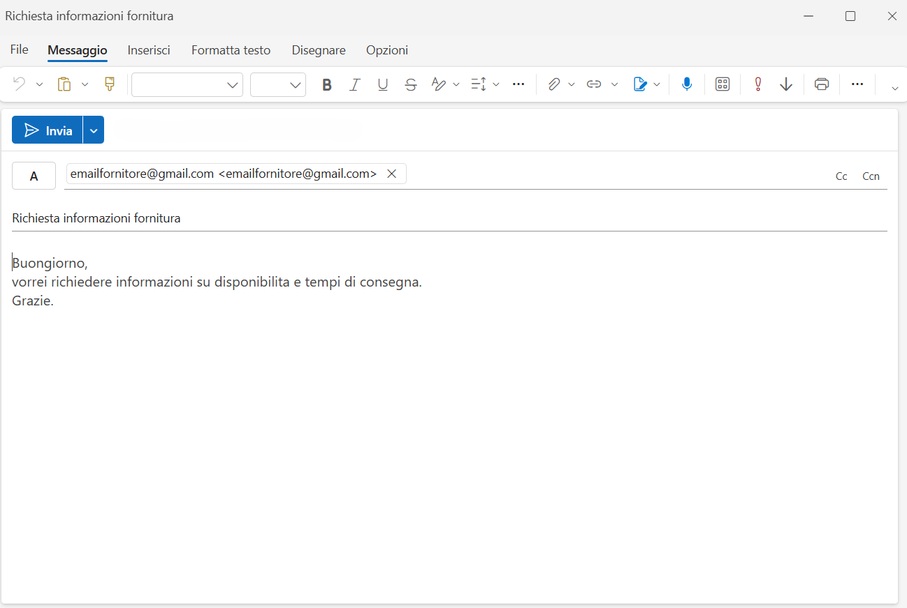
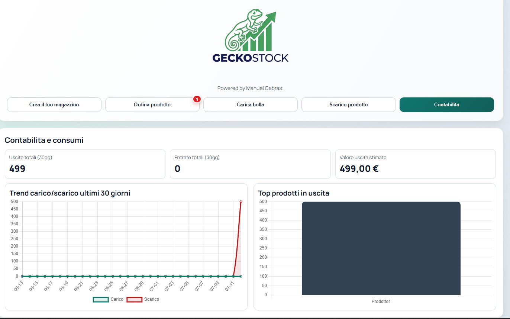

# 🦎 GeckoStock

Applicazione full-stack per la gestione di scorte di magazzino, con calcolo automatico delle soglie di riordino basato sui consumi storici e notifica via email ai fornitori.



## Funzionalità

- **Gestione magazzino**: creazione prodotti con codice, categoria, lotto, unità di misura e scadenza
- **Carico bolla**: registrazione DDT con più righe prodotto, aggiornamento automatico dello stock
- **Scarico prodotto**: ricerca rapida con autocomplete e storico movimenti
- **Ordina prodotto**: suggerimenti intelligenti di riordino con invio email precompilata al fornitore
- **Contabilità**: dashboard con trend carico/scarico degli ultimi 30 giorni e top prodotti in uscita
- API REST con FastAPI, documentazione Swagger/OpenAPI e test con pytest

## Stack

- Python 3.11+
- FastAPI
- SQLAlchemy
- Pydantic
- SQLite
- Uvicorn
- Jinja2
- Pytest

## 🎯 Punto di forza: logica di riordino intelligente

Il calcolo della soglia di riordino non è un valore fisso, ma si adatta ai consumi reali:

1. `scarico_totale_anno` = somma degli scarichi dall'inizio dell'anno corrente fino ad oggi
2. `settimana_corrente` = numero della settimana ISO dell'anno corrente
3. `consumo_medio_settimanale` = `scarico_totale_anno / settimana_corrente`
4. `soglia_riordino` = `consumo_medio_settimanale * 4`
5. `quantita_da_ordinare` = `soglia_riordino - current_stock`

Se la quantità è maggiore di zero, viene generato un alert; altrimenti no.
Se l'anno è ancora agli inizi e non ci sono dati sufficienti, il sistema usa lo storico dell'anno precedente; se non esiste, il prodotto viene segnato come dati insufficienti.

**Esempio numerico:**
- scarico totale anno: 24 unità
- settimana corrente: 6
- consumo medio settimanale: 4
- soglia di riordino: 16
- stock attuale: 10
- quantità da ordinare: 6

## Screenshot

### Crea il tuo magazzino
Aggiunta prodotti con codice, categoria, lotto e scadenza.


### Carica bolla
Registrazione DDT multi-riga: le quantità si sommano automaticamente allo stock.



### Scarico prodotto
Ricerca con autocomplete e storico movimenti in tempo reale.



### Ordina prodotto
Suggerimenti di riordino automatici e invio richiesta al fornitore via email precompilata.



### Email precompilata al fornitore
Un click apre il client email con destinatario, oggetto e testo già pronti.



### Contabilità
Dashboard con trend carico/scarico e top prodotti in uscita.



## Installazione

```bash
python -m venv .venv
```

Windows:
```bash
.venv\Scripts\activate
```

macOS / Linux:
```bash
source .venv/bin/activate
```

```bash
pip install -r requirements.txt
```

## Avvio

```bash
uvicorn app.main:app --reload
```

La documentazione API sarà disponibile su:
- http://127.0.0.1:8000/docs
- http://127.0.0.1:8000/redoc

## Esempio di chiamata API

Creazione di un prodotto:
```bash
curl -X POST "http://127.0.0.1:8000/products" -H "Content-Type: application/json" -d "{\"name\":\"Siringhe\",\"unit\":\"confezione\",\"current_stock\":10}"
```

Registrazione di uno scarico:
```bash
curl -X POST "http://127.0.0.1:8000/movements" -H "Content-Type: application/json" -d "{\"product_id\":1,\"movement_type\":\"scarico\",\"quantity\":3,\"movement_date\":\"2026-07-06\"}"
```

## Test

```bash
pytest -q
```

---

Powered by [Manuel Cabras](https://github.com/Code-Manuel)
